# 📸 Platinum Drive - Screenshots Gallery

A visual tour of Platinum Drive's features and user interface. All screenshots showcase the Arabic interface.

> **Note:** Platinum Drive is currently available **only in Arabic language** with full RTL (Right-to-Left) support.

---

## 🏠 Main Dashboard & Home

### Home Page

The main dashboard showing the file explorer interface with sidebar navigation, folder structure, and file management tools. Users can quickly access their files, folders, and navigate through the system.

### Home with Notifications
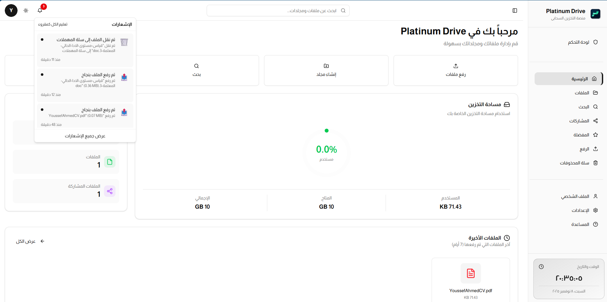
The home page with the notifications dropdown opened, displaying real-time alerts and updates for the user including file activities, shares, and system notifications.

---

## 📁 File Management

### File Upload

The drag-and-drop file upload interface with progress tracking, file type validation, and real-time upload status. Supports multiple file uploads with size and type restrictions based on admin policies.

### Create File
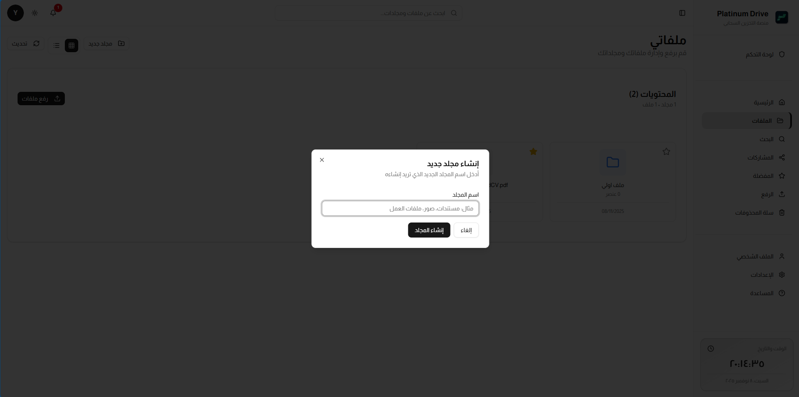
File creation interface allowing users to create new text files or documents directly within the platform, with folder selection and naming options.

### Favorites
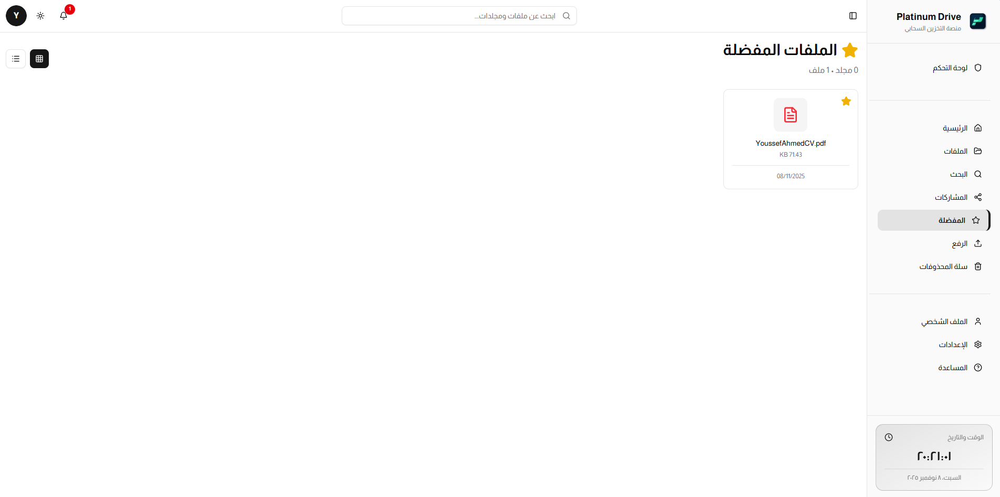
A dedicated view for all favorited files and folders, making it easy to access frequently used items. Users can quickly star/unstar items for easy retrieval.

### Trash/Recycle Bin
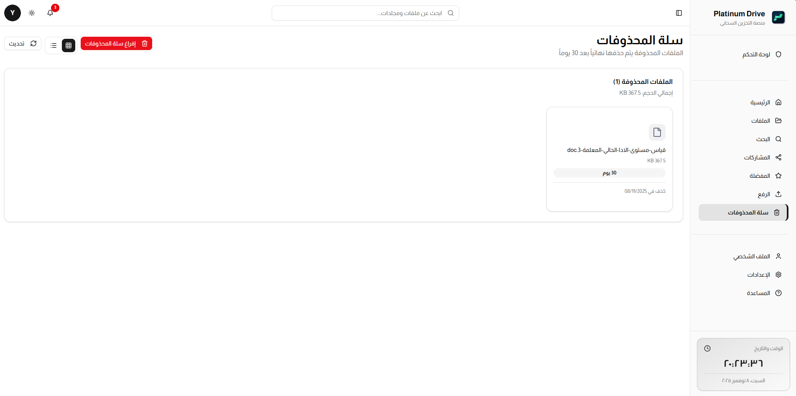
The recycle bin showing deleted files and folders with options to restore or permanently delete items. Includes automatic cleanup after 30 days.

---

## 🔍 Search & Discovery

### Search Results
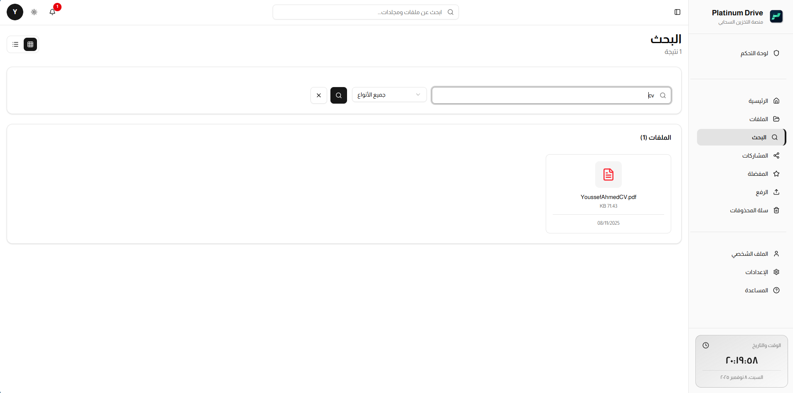
Powerful search functionality allowing users to find files and folders across their entire storage with instant results and filtering options.

---

## 🔔 Notifications

### Notifications Center
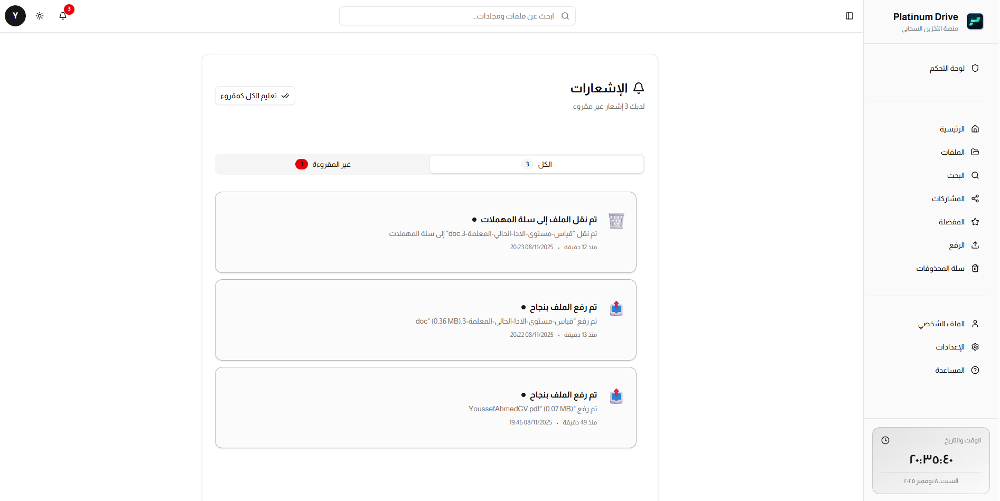
Comprehensive notification center displaying all user notifications including file activities, shares, system alerts, and security notifications with timestamp tracking.

---

## 🤝 Sharing & Collaboration

### Shared Files
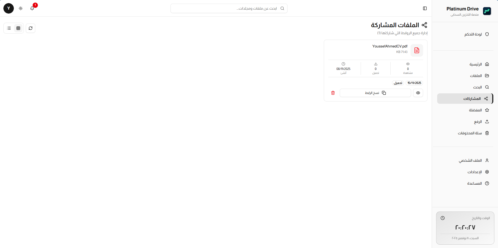
Management interface for all shared files and folders, showing share links, expiration dates, download counts, and options to revoke access.

---

## 👤 User Profile

### Profile - General Settings
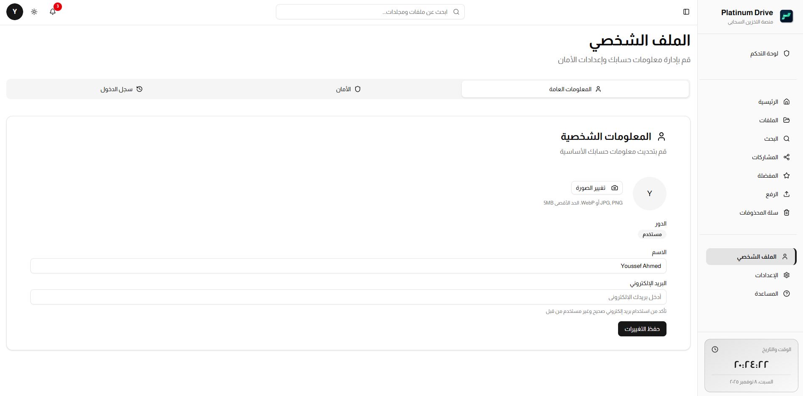
User profile page showing personal information, avatar upload, and account details. Users can update their profile information and preferences.

### Profile - Security Settings
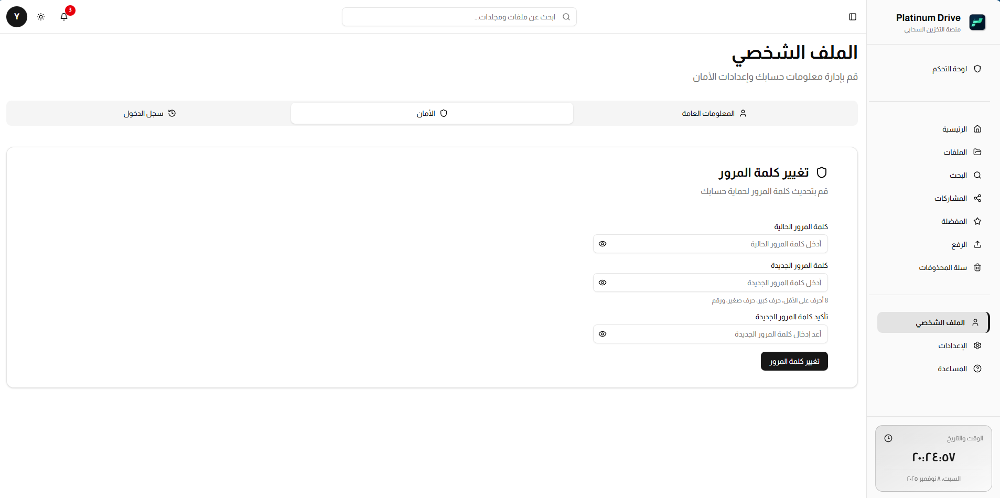
Security settings tab where users can change their password, enable two-factor authentication, and manage security preferences.

### Profile - Login History
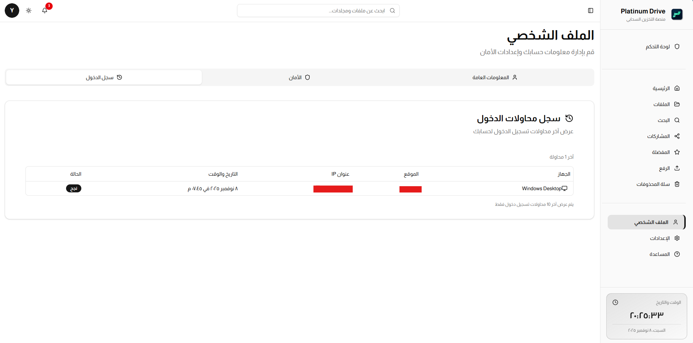
Detailed login history showing all account access attempts with timestamps, IP addresses, and device information for security auditing.

---

## ⚙️ User Settings

### Settings - General

General application settings including language preferences, theme selection, and display options.

### Settings - Security
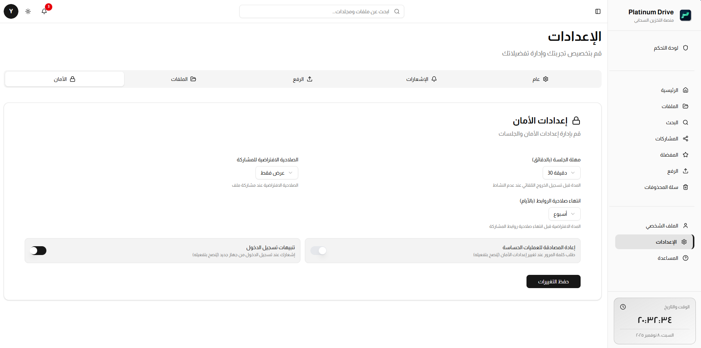
User-level security settings for managing account security features and privacy options.

### Settings - Files
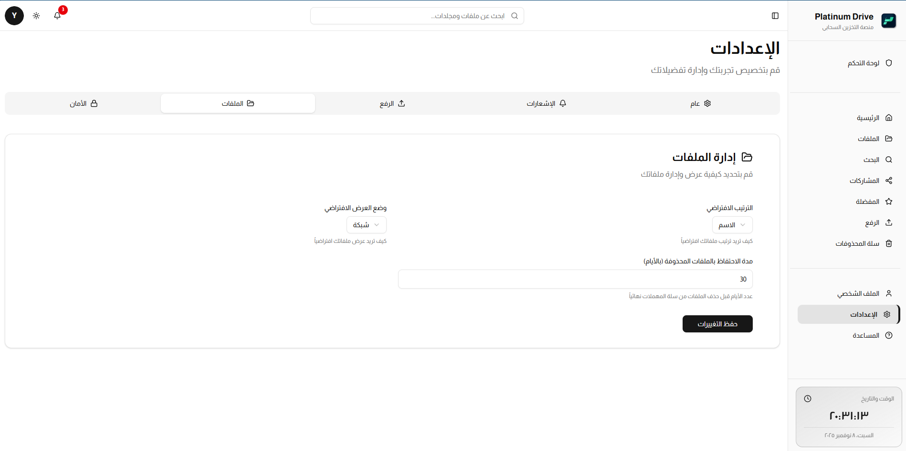
File management preferences including default upload locations, file view options, and sorting preferences.

### Settings - Notifications
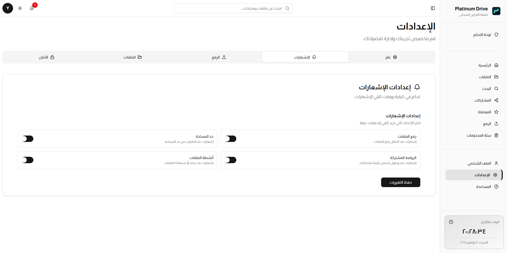
Notification preferences allowing users to customize which notifications they receive and how they're delivered.

### Settings - Upload
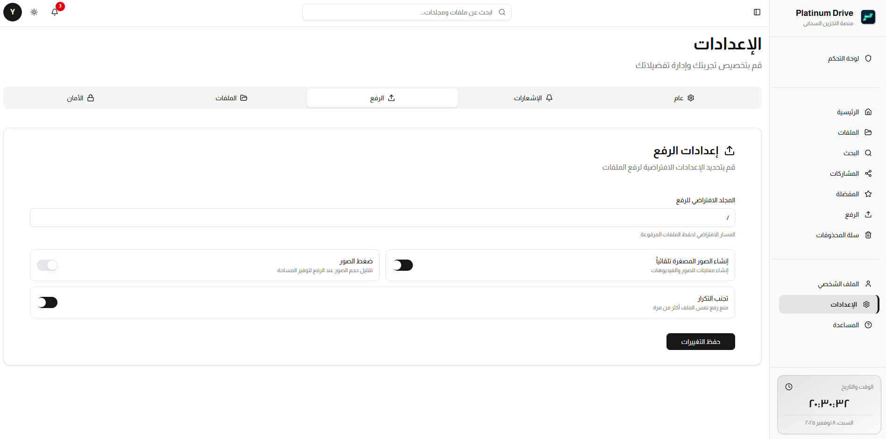
Upload preferences including default upload behavior, file naming conventions, and upload quality settings.

---

## 🛠️ Admin Panel

### Admin Dashboard

The admin control panel showing system overview with total users, files, storage usage statistics, and visual charts for monitoring system health.

### Admin - Security Settings
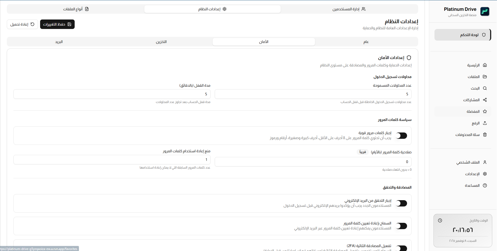
Global security settings where admins can enforce two-factor authentication, set password policies, configure login attempt limits, and manage account lockout rules.

### Admin - Email Configuration
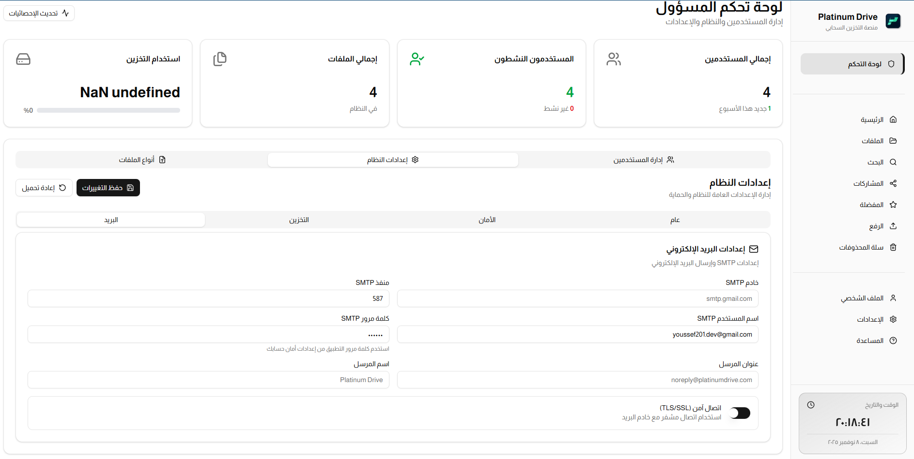
SMTP email server configuration for sending verification emails, 2FA codes, notifications, and system alerts to users.

### Admin - Storage Management
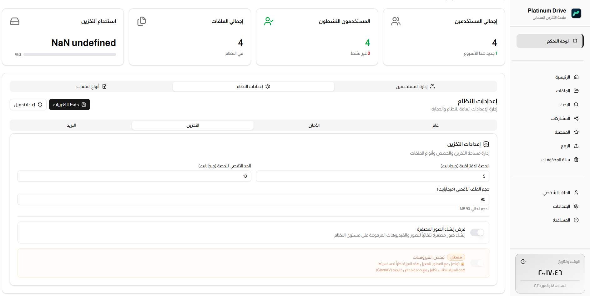
Storage quota management interface where admins can set default storage limits, manage per-user quotas, and configure auto-cleanup policies.

---

## 🆘 Help Center

### Help & Documentation
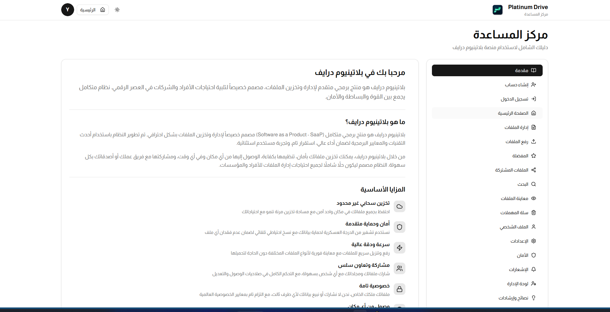
Comprehensive help center providing user guides, FAQs, and documentation to assist users in navigating and utilizing all platform features.

---

## 🎨 Design Highlights

- **Modern RTL Interface**: Fully optimized for Arabic language with right-to-left layout
- **Dark Mode Support**: System-aware dark mode with smooth transitions
- **Responsive Design**: Works seamlessly on desktop, tablet, and mobile devices
- **Intuitive Navigation**: Tab-based navigation with clear visual indicators
- **Arabic Calendar**: Integrated Hijri calendar support for date displays
- **Toast Notifications**: Non-intrusive success/error messages
- **Progress Tracking**: Real-time feedback for uploads and operations
- **Visual Analytics**: Charts and graphs for storage usage and statistics

---

## 🌐 Language Note

**Platinum Drive is currently available exclusively in Arabic language** with full RTL (Right-to-Left) support. The interface is optimized for Arabic-speaking users and includes:

- Native Arabic typography and fonts
- Hijri calendar integration
- Arabic date and time formatting
- Culturally appropriate UI/UX elements
- RTL-optimized layouts and components

---

*For more information, see the [README](README.md) file.*
